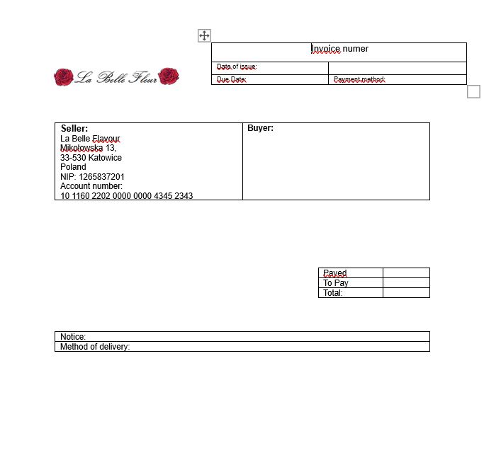

## Invoice Generator

Invoice generator is a project created in Excel using VBA (Visual Basic for Applications). The program is connected to a Word application. It is a system for generating invoices based on an existing database of products. The generator was developed using User Forms. The program operates by allowing the user to input invoice data. Subsequently, the program stores the invoice data in the database, and a PDF file is generated with a template of the document.

Before running, please check the available references in VBA such as Microsoft Word Library and Microsoft Form Library. Also, update the file paths for saving files and the Word input file (invoice template). The locations are marked in the code with comments. 

## How it works?

The first step is to run the macro by clicking the "Create new invoice" button. The user enters data into fields related to the customer, such as Customer Name, City, Street, Number, and Postcode. The Postcode field has restrictions in terms of maximum character length and the position of the '-' character within the text. The user can only enter digits and the '-' symbol; all other characters are not allowed.
For this purpose, UserForms properties have been applied. Next, the user is required to fill in the Customer NIP field (up to a maximum of 11 characters).

The next stage involves selecting the delivery and payment method. The selection is made by choosing an item from the list, and the field is non-editable.

Subsequently, the user adds products to the invoice from the Products list along with their quantity. Attempting to add a zero quantity or leaving it blank is protected during the invoice generation stage. The 'Add' button is disabled in such cases.

Items added to the invoice can be deleted or edited. The 'Total Price' field reflects the order's total cost. After entering an advance payment in the 'Paid' cell, the information will be appropriately updated in the database and on the invoice.

Finally, upon clicking the 'Finish' button, the completeness of the data is checked. If the invoice is error-free, it is generated. The data is stored in the 'Invoice Database' worksheet, and a PDF file is generated based on an Word template, utilizing references to 'Bookmarks'.

